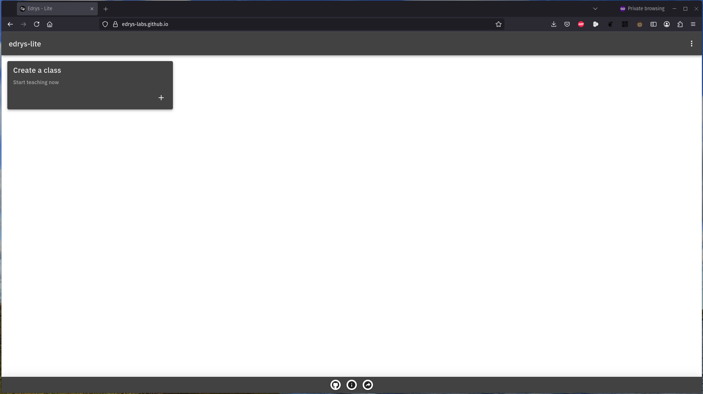
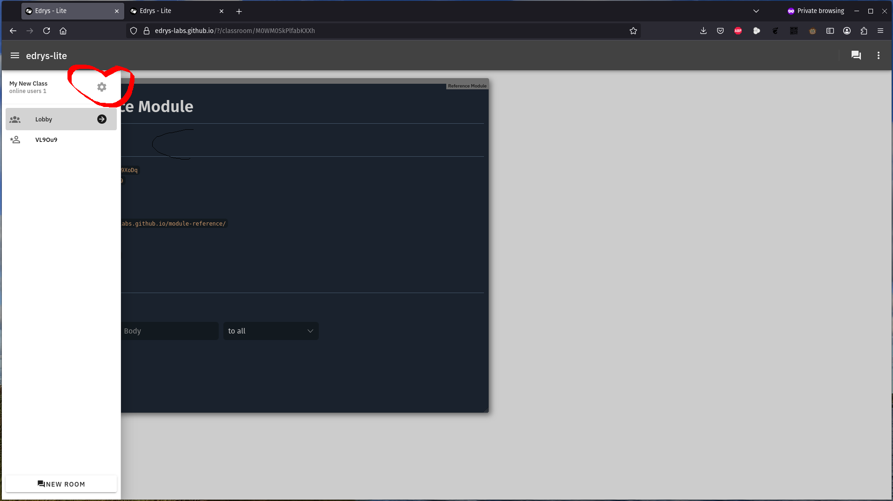

<!--
author:   Dr. Ines Aubel    
version:  1.0.0
language: en
narrator: UK English Female
comment:  Slide deck for the "Hands-on Remote Labs with edrys-Lite" workshop - 2 hour interactive workshop
icon: https://cross-lab.org/content/images/2021/11/Logo-mit-5-mehrfarbig.png
-->

# Hands-on Remote Labs with edrys-Lite

---

**Duration:** 2 hours  

**Format:** Hands-on & Interactive  

---

**Dr. Ines Aubel** - 
Chemical Technology

> *"I'm a chemist, not a programmer – if I can build remote labs, so can you!"*


## Learning Outcomes

---

By the end of today, you will:

✅ **Understand** what edrys-Lite can do for your teaching

✅ **Build** your own working remote lab

✅ **See** hardware and browser working together

✅ **Judge** if edrys-Lite fits your scenarios

---

## Workshop Structure

---

* Welcome & Quick Start - Demo + Try 
* Building Your Lab - Hands-on 
* Experimentation - Explore  
* Wrap-up - Resources 

---

## What is edrys-Lite?

---

Browser-based platform for remote labs

🌐 Runs entirely in your browser

🔌 No server installation needed

🤝 Real-time collaboration

🧩 Modular and flexible

🔬 Control real hardware remotely

---


> Live Demo

---

### What You Just Saw

---

✅ Browser-based interface

✅ Multiple modules (editor, camera, terminal)

✅ Real hardware control (micro:bit)

✅ Real-time collaboration

✅ No installation required

---

### Key Technologies

---

**WebRTC:** Direct browser-to-browser communication

- Peer-to-peer connections
- No central server bottleneck
- Low latency

---

**CRDTs (Yjs):** Conflict-free data synchronization

- Multiple users editing simultaneously
- Automatic conflict resolution
- Works offline

---

## Your Turn: Join a Classroom

---

**Instructions:**

1. Open Chrome
2. Go to: **[URL will be shared]**
3. Join as a student
4. Explore the modules!


--- 

# Building Your Lab

> *Now you become the creator!*

**What we'll do:**

- Create your own classroom
- Add & configure modules
- Connect your micro:bit

**We go step-by-step together!**

## Step 1: Create Your Classroom

---

**Follow along:**

1. New browser tab (Chrome)
2. Go to: https://edrys-labs.github.io
3. Click **"Create Class"**
4. Your classroom is created!
5. **Copy the URL** – you'll need it

---



---

## Step 2: Configure Settings

---

1. Click the ⚙️ **Settings** icon
2. **General tab:**

   - Class name: "My Remote Lab"
   - Description: "Hands-on micro:bit lab"
   - Keep other defaults
3. **Members tab:**

   - Student IDs: `*` (anyone can join)
4. **Save**

---



---

### Peer Check ✅

---


**Share with your neighbor:**

- Share your classroom URL
- Join each other's classroom
- Verify it works!

---

### Understanding Modules

---

Modules are building blocks for your lab:

🧩 Each module = one function

📝 Markdown = instructions

💻 Editor = code writing

🖥️ Terminal = hardware control

📹 Camera = visual observation

🎛️ Mix and match as needed!

---

## Step 3: Add Markdown Module

---

**Settings → Modules → Add Module**


> URL: https://github.com/edrys-labs/module-markdown-it


**Configure:**

- Name: "Instructions"
- Show in: `lobby`

---

### Markdown Module Content

---

**In "General" settings, add:**

```markdown
  # Microbit V2 MicroPython Intro

  Welcome to the Microbit V2 MicroPython course. In this module, you will receive a general overview of the course content including:

  - **API Overview:** Understand how to interact with the board’s functionalities.
  - **Sensors:** Learn about accelerometers, temperature sensors, and more.
  - **Sound & Display:** Discover how to program the board to produce sound and display images.

  This course is designed to provide you with both theoretical insights and practical examples to get started with MicroPython on the Microbit V2.
```

---

### Add Second Markdown Module

---

- Name: "Instructions"
- Show in: `station`

---

**In "General" settings, add:**

```` yaml
content: |-
     # MicroPython with Microbit V2: Hands-on Examples

     Welcome students! In this module, you'll explore practical examples that demonstrate how to interact with your Microbit V2 board using MicroPython.

     ## Example 1: Basic Arithmetic and Display

     ```python
     # Perform a simple arithmetic operation and display the result
     result = 12 + 2
     print("The result is:", result)
     ```

     ## Example 2: Display an Image

     ```python
     from microbit import *

     display.show(Image.HEART)
     ```

     ## Example 3: Using the Accelerometer Sensor

     ```python
     from microbit import *

     while True:
         # Get the X-axis reading from the accelerometer
         x_reading = accelerometer.get_x()

         print("X-axis:", x_reading)

         sleep(1000)
   ```

   Experiment with these examples to see how the Microbit V2 reacts to your code!
````


## Step 4: Add module-serial module

---

**Add Module**


> URL: https://edrys-labs.github.io/module-serial/index.html


**Configure:**

- Show in: `station`


---

## Lobby vs. Station

---

**Lobby:** Main classroom space (everyone) 

**Station:** Hardware location (where equipment is)

> Today: You play both roles on one computer  
> Real scenario: Station = separate computer with equipment

---


## Now: The Hardware Part! 🔌

---

BBC micro:bit v2:

- 5×5 LED display
- 2 buttons
- Sensors (temperature, light, motion)
- Bluetooth & USB
- MicroPython programmable


---

## Step 6: Connect Micro:bit

---

**Physical connection:**

1. Take your micro:bit
2. Connect USB cable to micro:bit
3. Connect other end to your computer
4. Micro:bit lights up? ✅ Good!

---

## Step 7: Open Station View

---

1. Look for room selector (top left)
2. See "Lobby" and "Station"?
3. Click **"Station"**
4. You should see your terminal module

---

## Step 8: Connect via WebSerial

---

**In the terminal module:**

1. Click **"Connect"** button
2. Browser popup appears
3. Select **"BBC micro:bit"** device
4. Click **"Connect"**

---

## Step 9: First Command!

---

**In the terminal, type:**

```python
from microbit import *
```

Press **Enter** (nothing visible – that's okay!)

**Then type:**

```python
display.show(Image.HEART)
```

Press **Enter**

**Look at your micro:bit! ❤️**


---

## Try More Commands

---

```python
display.scroll("Hello")
```

```python
display.show(Image.HAPPY)
```

```python
display.clear()
```

**Experiment for 2-3 minutes!**

---

## Troubleshooting Common Issues

---

**No device in popup?**

- Check cable connections
- Try different USB port
- Try different cable

**Commands don't work?**

- Press Enter after typing
- Try Ctrl+C then Ctrl+D to restart
- Check for error messages

**Help your neighbor if they're stuck!**

---


## Where edrys-Lite Works Well ✅

---

**Strengths:**

- Simple equipment with serial/network interface
- Visual observation important
- Collaborative learning
- Low-stakes experimentation
- Demos and tutorials
- Expensive equipment sharing

---

## Where edrys-Lite Has Limits ⚠️

---

**Limitations:**

- Complex physical manipulation
- Immediate safety intervention needed
- Very expensive/fragile equipment (risk!)
- Precise timing beyond network latency
- Primary goal is tactile/hands-on skill

**Be realistic about what fits!**

---

## The Key Question

---

> "Is remote access the RIGHT solution  
> for THIS learning goal?"

Sometimes yes, sometimes no.  
**Both answers are valid!**


## Three Key Insights

---

**Remember these:**

1. 🌐 **Browser-based = Accessible**  
   No installations. Just a URL.

2. 🧩 **Modular = Flexible**  
   Build exactly what you need.

3. 🤝 **Peer-to-peer = Scalable**  
   No expensive servers.

---

## Essential Resources

📚 **Documentation**  
[https://edrys-labs.github.io/](https://edrys-labs.github.io/)

🧩 **Module Library**  
[https://github.com/edrys-labs](https://github.com/edrys-labs)

💬 **Community Support**  
[https://github.com/edrys-org/edrys-Lite/discussions](https://github.com/edrys-org/edrys-Lite/discussions)

📝 **Blog & Tutorials**  
[https://cross-lab.org/](https://cross-lab.org/)

📹 **Video Examples**  
[YouTube: edrys-org](https://www.youtube.com/@edrys-org)

*Handout with all links available!*


## Save Your Work! 💾

---

**Do this NOW:**

**Option 1:** Bookmark your classroom URL

**Option 2:** Export configuration

- Settings → Share → Export
- Save the YAML file


---


<!-- 
LiaScript Slide Deck
End of workshop presentation

INSTRUCTOR NOTES:
- Demo classroom URL to be shared during workshop
- Adjust break timing based on actual schedule
- Contact details provided in handout
- Resource links are live and current as of Dec 2025
- Photos from workshop can be added to final slides if desired
-->
